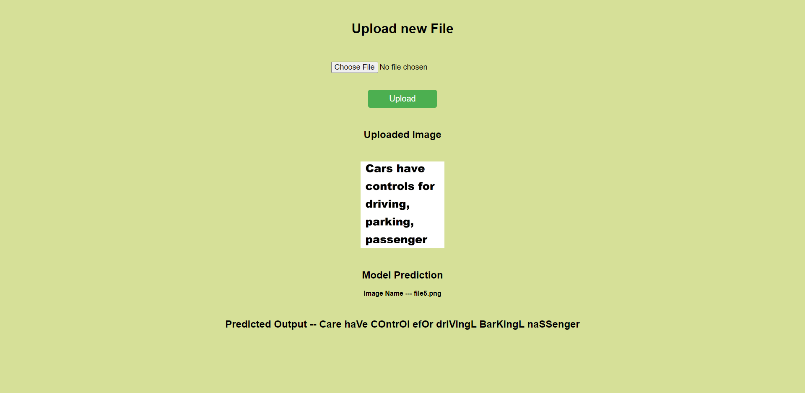

# Optical Character Recognition (OCR) with Neural Networks

This project aims to recognize English letters from images using neural networks and custom NumPy logic. The goal is to extract text from images and display it in a web application built with Flask.

## Installation

1. Clone this repository.
2. Install the required dependencies using pip: `pip install -r requirements.txt`

## Usage

1. Place the image file to be recognized in the `Static` folder.
2. Run `python app.py`.
3. Navigate to `http://localhost:5000` in your web browser.
4. Click on the `Choose File` button and select the image file.
5. Click on the `Upload` button to start the OCR process.
6. The recognized text will be displayed on the web page.

## Approach

1. The input image is first preprocessed to improve its quality and contrast using OpenCV.
2. Custom NumPy logic is used to separate the image into paragraphs, sentences, words, and letters.
3. The resulting letters are fed into a neural network that was trained on English letters using a dataset such as MNIST.
4. The output of the neural network is the recognized text.
5. The recognized text is displayed in a web application built with Flask.

## Contributing

Contributions are welcome! Please fork this repository and submit a pull request with your changes.
